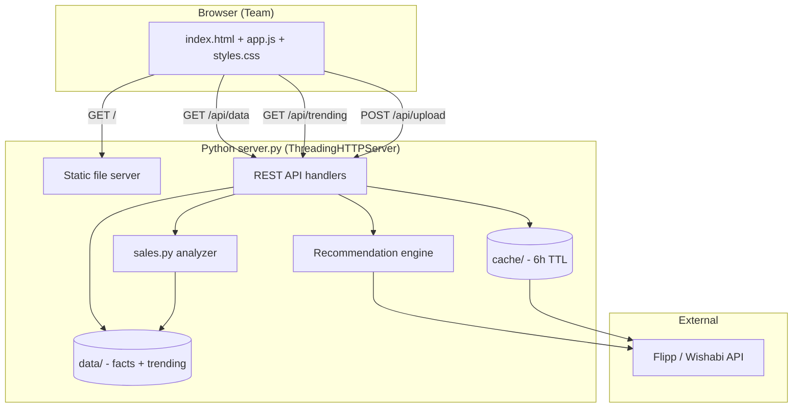

# Competitor Watch — Summary, Architecture & Backend

**Live URL:** [https://competitor-watch-jqdn.onrender.com/](https://competitor-watch-jqdn.onrender.com/)

---

## 1. Summary

**Competitor Watch** is a web app built for **La Bodega Supermercado y Restaurante**. It helps the team decide **what to feature on weekends** by combining:

1. **Live competitor weekly ads** (from Flipp/Wishabi by ZIP code)
2. **La Bodega's own sales patterns** (from uploaded CSV reports)

### What it does

| Feature | Purpose |
|--------|---------|
| **Combos & weekend packs** | Finds bundle / paquete / multi-buy deals near selected ZIPs so you can copy ideas for Sat & Sun |
| **What to feature this weekend** | Auto-generated plan from this week's live ads + your sales (meat hook, protect tortilla, grow basket, midweek points) |
| **Live competitor deals** | Browse all deals by category, retailer, or Latino groceries only |
| **Trending in the market** | Top 10 products advertised across 8 US Latino metros — split into Mexican/Latino vs American supermarkets |
| **Upload sales data** | Drop a monthly/weekly CSV to refresh basket stats, attach rates, and recommendations |
| **Product search** | Search any product name across competitor weekly ads in the current ZIP area |

### Who it's for

Store owners and staff who need a **simple, actionable view** of competitor pricing and weekend merchandising — without spreadsheets or manual ad checking.

### Tech at a glance

- **Backend:** Python 3.12, standard library only (no pip packages)
- **Frontend:** Plain HTML, CSS, JavaScript
- **Data source:** Flipp/Wishabi unofficial API (`backflipp.wishabi.com`)
- **Hosting:** Render.com (Docker or Python)
- **Auth (optional):** HTTP Basic Auth via `APP_PASSWORD` env var

---

## 2. Architecture



### Request flow

1. **Page load** → browser fetches `index.html`, `app.js`, `styles.css`, `logo.png`
2. **`/api/data`** → server scans ZIPs × categories on Flipp, builds combos, runs recommendation engine, returns one JSON payload (~20–40s on cold start)
3. **`/api/trending`** → separate national scan (8 metros × 12 terms), cached 12 hours, loads in background
4. **`/api/upload`** → user CSV → `sales.analyze()` → saves `data/sales_facts.json` → next `/api/data` uses updated facts

### Folder structure

```
competitor-watch/
├── server.py          # Main backend: HTTP server, Flipp proxy, APIs, recommendations
├── sales.py           # CSV sales analyzer
├── config.json        # Store, ZIPs, categories, Latino merchants, presets
├── Dockerfile         # Container for Render
├── Procfile           # Alternative: web: python server.py
├── public/            # Frontend (served as static files)
│   ├── index.html
│   ├── app.js
│   ├── styles.css
│   └── logo.png
├── cache/             # Flipp response cache (git-ignored, 6h TTL)
└── data/              # Uploaded sales facts + trending cache (git-ignored)
    ├── sales_facts.json
    └── trending.json
```

---

## 3. Backend (detailed)

### 3.1 HTTP server (`server.py`)

Built on Python's **`http.server.BaseHTTPRequestHandler`** and **`ThreadingHTTPServer`**.

| Method | Route | Description |
|--------|-------|-------------|
| GET | `/` | Serves `public/index.html` |
| GET | `/api/health` | `{"ok": true}` — health check |
| GET | `/api/data` | Full dashboard payload (deals, combos, recommendations) |
| GET | `/api/data?zips=77081,77036` | Same, but for custom ZIP list |
| GET | `/api/data?refresh=1` | Clears Flipp cache, rebuilds |
| GET | `/api/trending` | National trending top 10 (Latino + mainstream) |
| GET | `/api/trending?refresh=1` | Force rebuild trending |
| GET | `/api/search?q=chorizo` | Search weekly ads for any product term |
| GET | `/api/search?q=jarritos&zips=77081,77036&latino=1` | Search in custom ZIPs, Latino stores only |
| POST | `/api/upload` | Upload sales CSV (body = raw CSV, header `X-Filename`) |

**Auth:** If `APP_PASSWORD` is set, all routes except `/api/health` require HTTP Basic Auth (password only).

**Port:** Reads `PORT` env var (Render sets this); defaults to `8000`.

---

### 3.2 External data: Flipp API

```
GET https://backflipp.wishabi.com/flipp/items/search
    ?q={search_term}
    &postal_code={zip}
    &locale=en-us
```

Each search is **cached on disk** (`cache/{md5}.json`) for **6 hours** to limit API calls and speed up repeat loads.

**Normalized deal object** (`clean_item`):

- `merchant`, `name`, `price`, `unit`, `sale_story`, `valid_to`, `is_latino`, `zip`, `zips[]`

---

### 3.3 Data gathering modules

| Function | What it does |
|----------|--------------|
| `gather_category()` | For each category in config, searches terms × ZIPs, dedupes, sorts by price |
| `gather_combos()` | Searches combo/paquete terms, filters food + Latino-first, tags ZIPs |
| `gather_trending()` | Scans 8 national metros × 12 product terms, ranks by store + metro breadth |

**Latino detection:** Merchant name matched against `latino_merchants` in `config.json` (El Rancho, Fiesta, Michoacana, etc.).

**Food filter:** Non-grocery items (cookware, apparel, etc.) excluded via category labels and blocklists.

---

### 3.4 Recommendation engine (`build_recommendations`)

Combines **live competitor deals** + **your sales facts** into 4–7 cards:

| Tag | Logic |
|-----|--------|
| **BRING PEOPLE IN** | Cheapest live meat ad → "match this cut Sat/Sun" |
| **GROW THE BASKET (combo)** | Best Latino weekend pack spotted → "copy this idea" |
| **PROTECT MARGIN** | If competitors discount tortillas → "don't chase, stock deep" |
| **GROW THE BASKET (attach)** | Top 3 add-ons by headroom + whether competitors are advertising them |
| **LIFT SLOW DAYS** | 2× points Tue/Wed from weekend vs weekday revenue gap |

Output includes `week_signal` — one-line summary of what's live this week.

---

### 3.5 Sales analyzer (`sales.py`)

**Input:** CSV export (Odoo-style `sale.report`: Order, Order Date, Product, Qty, Total, Unit Price)

**Output (`facts`):**

- `meat_basket_avg` / `nonmeat_basket_avg`
- `weekend_rev_per_day` / `weekday_rev_per_day`
- `attach_rates_pct` — % of meat baskets that also include charcoal, soda, queso, etc.
- `hero_seller` / `hero_basket_avg`
- `orders`, `total_revenue`, `source_label`

Saved to `data/sales_facts.json` and merged with defaults from `config.json`.

---

### 3.6 Configuration (`config.json`)

Central config — no code changes needed for most tweaks:

- **`zips`** — local competitor scan area (Calhoun GA + nearby)
- **`trending_zips`** — 8 US Latino metros for national trending
- **`categories`** — search terms, roles (`anchor`, `protect`, `attach`), keyword matching for your sales CSV
- **`area_presets`** — Houston, Dallas, Miami, etc. (UI chips)
- **`latino_merchants`**, **`combo_keywords`**, **`combo_search_terms`**, **`trending_terms`**

---

### 3.7 Frontend (`public/app.js`)

Vanilla JavaScript — no React/Vue/npm.

- **`load()`** → fetches `/api/data`, renders all sections
- **`loadTrending()`** → fetches `/api/trending` in parallel
- **Filters:** ZIP presets, combo ZIP filter, Latino-only, category/retailer on deals grid
- **Upload:** File input → POST CSV → reload data

---

### 3.8 Deployment (Render)

| Setting | Value |
|---------|--------|
| **Root Directory** | *(blank — repo root has Dockerfile + server.py)* |
| **Environment** | Docker **or** Python 3 |
| **Start command** | `python server.py` |
| **Env var (optional)** | `APP_PASSWORD` = team password |

**Free tier note:** Service sleeps after ~15 min idle; first request can take 30–60s to wake.

---

## 4. Data flow (one weekend workflow)

```
1. Team opens https://competitor-watch-jqdn.onrender.com/
2. App loads combos near Calhoun ZIPs (or switch to Houston preset)
3. Trending shows what's hot nationally (Jarritos, Maseca, Chorizo Cacique…)
4. "What to feature" card says: match Food Lion chicken $0.79/lb Sat/Sun
5. Optional: upload new sales CSV → attach rates refresh
6. Staff uses combos + recommendations to plan Sat/Sun ad
```

---

## 5. Limitations (good to know)

- Flipp is **unofficial** — no guarantee of completeness or accuracy; verify before printing ads
- "Trending" = **most widely advertised**, not a true "new arrival" SKU feed
- Uploaded sales **unit prices** were removed from UI comparisons (line totals vs per-lb competitor prices were misleading)
- **Disk cache** on Render free tier resets on redeploy; trending/sales upload persist in `data/` until redeploy unless you add persistent storage
